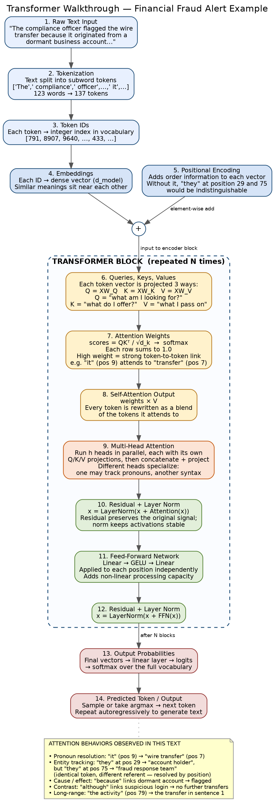

# Module 3 Attention Walkthrough: Financial Fraud Alert Example

**MAI 600 — Natural Language Processing | Atlantis University | Summer C 2026**

---

## Problem Description

This project explains how a Transformer model uses self-attention to process a short financial fraud investigation summary. The goal is not to train a model — it is to trace how raw text becomes model input, identify which token relationships the model has to resolve in order to read the paragraph correctly, and explain how the pieces of the Transformer architecture work together to make that possible.

The paragraph was chosen specifically because it cannot be understood word by word. It contains pronouns whose meaning depends on earlier context, a reference that reaches back across three sentences, and a contrast clause that reverses the conclusion. Those are exactly the relationships attention exists to handle.

---

## Dataset / Text Description

| Item | Detail |
|---|---|
| **Source** | Original text — written by me for this assignment |
| **Domain** | Financial services / fraud operations |
| **Text type** | Fraud investigation case summary |
| **Length** | 123 words, 6 sentences, 137 tokens (`cl100k_base`) |
| **Sensitive data** | None. No real customers, accounts, institutions, or identifiers. Entirely fictional and safe to publish publicly. |

**Why this text was selected:** my focus in this program is AI applied to finance and business, so I wanted a sample from a workflow I actually care about. It also happens to be unusually dense with reference relationships for its length — two pronouns pointing at different entities, a cause/effect chain, a long-range reference, and a contrast, all in six sentences.

The text sample:

> The compliance officer flagged the international wire transfer because it originated from a business account that had been dormant for nearly eight months. The account holder stated that they had not authorized the payment and did not recognize the receiving institution. The fraud response team froze the account temporarily, reversed the pending transfer, and required identity re-verification before restoring online access. After reviewing the full transaction history, they confirmed that the activity was inconsistent with the customer's established spending pattern. The investigation also revealed that the login preceding the request came from an unfamiliar device and region, although no additional unauthorized transfers were completed. Because the transfer was caught before settlement, the bank recovered the funds and closed the case without a loss.

---

## Tokenization Findings

Tokenized with `cl100k_base` (the tokenizer used by GPT-3.5 and GPT-4), so these counts are real, not estimated.

| Term | Tokens | Split into |
|---|---|---|
| `dormant` | 3 | `d` \| `orm` \| `ant` |
| `re-verification` | 3 | `re` \| `-` \| `verification` |
| `settlement` | 2 | `set` \| `tlement` |
| `unauthorized` | 2 | `un` \| `authorized` |
| `compliance` | 2 | `com` \| `pliance` |
| `it` | **1** | `it` |
| `they` | **1** | `they` |

The pattern worth noting: **the two words carrying the heaviest interpretive load in the paragraph are the cheapest tokens in it.** `dormant` costs three tokens but means the same thing everywhere. `they` costs one token and means two different things within the same paragraph. Token cost and interpretive difficulty are unrelated.

---

## Attention Behaviors Found

Five behaviors documented (three required):

**1. Pronoun resolution** — `it` (position 9) → `wire transfer` (positions 6–7)
Grammatically `it` could attach to `the compliance officer`, since both are earlier noun phrases. Only the transfer can plausibly "originate from an account," so the model has to use meaning rather than proximity to choose correctly.

**2. Entity tracking** — `they` (position 29) → `account holder`, but `they` (position 75) → `fraud response team`
The same token, 46 positions apart, resolving to two different entities. Nothing about the word itself distinguishes them. Getting this wrong would swap who reported the problem with who investigated it.

**3. Cause and effect** — `because ... dormant` (positions 8–18) → `flagged` (position 3)
The justification arrives *after* the action it explains, so the model has to hold `flagged` open and bind the reason back to it.

**4. Long-range dependency** — `the activity` (position 79) → `wire transfer` (positions 6–7)
A reference roughly 72 tokens back, across three sentence boundaries. This is the case where older recurrent architectures degraded, and where self-attention's direct token-to-token connections matter most.

**5. Contrast** — `although` (position 108) → `no additional unauthorized transfers`
This one clause reverses the conclusion of the paragraph. Miss it and the summary becomes "a breach occurred" rather than "suspicious activity, contained, no further loss" — a materially different finding in a compliance context.

---

## Transformer Diagram



Also available as [`transformer_diagram.pdf`](transformer_diagram.pdf).

The diagram traces the full path and labels every required component: raw text input, tokenization, token IDs, embeddings, positional encoding, queries/keys/values, attention weights, self-attention output, multi-head attention, residual connections and layer normalization, the feed-forward network, output probabilities, and the final predicted token.

---

## Results / Observations

**Positional encoding is not a detail — it is what makes this paragraph readable.** The notebook demonstrates this directly: two identical token vectors have cosine similarity of exactly 1.0 before positional encoding is added, and 0.873 afterward. Before that addition, the two `they` tokens are *literally the same vector*. Every distinction the model draws between them depends on that step happening first.

**Untrained attention does nothing.** The notebook implements scaled dot-product attention from scratch with random projection matrices, and the resulting attention weights come out nearly uniform — around 0.08 each across 12 tokens, essentially 1/12. That is the expected result, and it clarifies something important: the architecture supplies *capacity*, training supplies *behavior*. The sharp attention patterns in published visualizations, where a pronoun locks onto its antecedent, are entirely learned.

**Q, K, and V are three different jobs.** Writing the projections out made the split concrete in a way the formula alone did not: query is "what am I looking for," key is "what do I match against," value is "what I actually pass along." That is why one vector gets projected three separate ways instead of being used directly.

**A caution on interpretation.** Attention weights are often presented as an explanation of model behavior, and that framing is too generous. A weight indicates that one token influenced another; it does not say why, and dozens of heads across many layers interact in ways a single heatmap cannot capture. For a real fraud workflow like the one in this text, I would treat attention patterns as a debugging aid — not as an audit trail I would defend to a compliance reviewer.

---

## Repository Contents

```
mai600-module3-attention-walkthrough/
├── README.md                      # this file
├── attention_walkthrough.ipynb    # tokenization, attention from scratch, behavior tables
├── transformer_diagram.png        # annotated architecture diagram
├── transformer_diagram.pdf        # vector version of the diagram
├── ai_usage_disclosure.md         # AI tool usage disclosure
└── results/
    ├── attention_behaviors.csv    # exported behavior table
    └── tokens.csv                 # full token/position/ID listing
```

**Running the notebook:** open `attention_walkthrough.ipynb` in Google Colab or Jupyter and run all cells. The only dependency is `tiktoken`, installed by the first cell. No GPU or model download required.

---

## AI Tool Usage

Claude was used to help explain the Q/K/V mechanism, structure the notebook, and assist with the diagram layout. All token counts, positions, and numeric results in this repository come from actually running the notebook, and the analysis and reflection are written in my own words. Full disclosure in [`ai_usage_disclosure.md`](ai_usage_disclosure.md).
